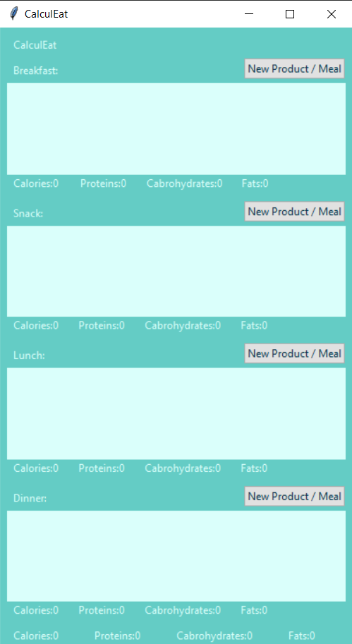
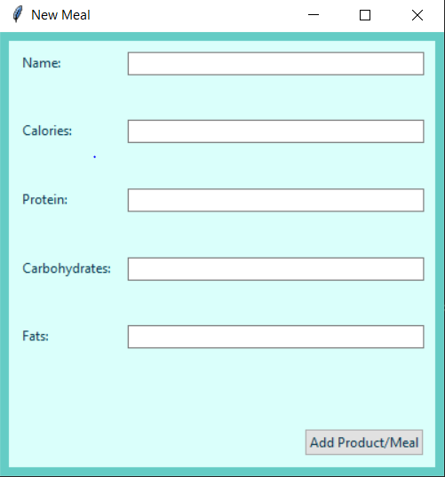

## Why this app was created?

The application has been designed to calculate the number of calories and
macronutrients in a meal, as well as 
the total calories and macronutrients consumed throughout 
the day.

### Prerequisites & Installation

  1. Tkinter (Python interface to the Tk GUI toolkit)

      ```pip install python-tk``` OR ```pip install python3-tk```

### Aplication

<div align='center'>


</div>

- The Main Window displays four meals, each with a separate frame and button to add a new meal. Upon clicking the button, a new window will open.
  When a meal is added, it will be attached to the corresponding frame.
  Below the frame, there is a summary of the macronutrients, and at the very bottom, 
  there is a summary of the entire day.
- The 'New Meal Window' appears when the 'New Product/Meal' button is selected from the main window.
   
  In this window, the name, calories, protein, carbohydrates, and fats of the product or meal can be entered.
  Once the information is entered, selecting the 'Add Product/Meal' button will attach the meal/product to the corresponding frame.

### Steps of Code Execution:

  1. Clone / Download this [repository](https://github.com/RafalC98/CalculEat)
  2. Open Command Window / Terminal on your system
  3. Trace to the respective location where the file is saved
  4. Run this [python file]() to execute the application